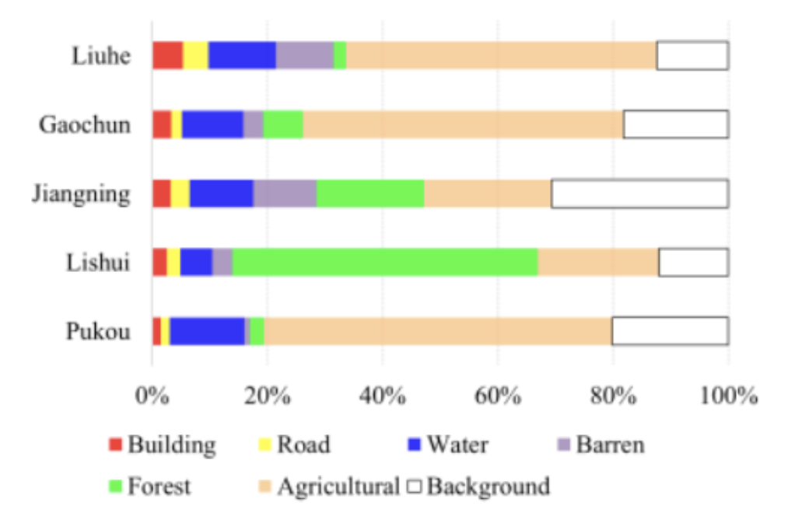

# Especialización en inteligencia artificial 

# Visión por Computadora II 
## Trabajo Práctico Integrador 
---

Integrantes

* Edgar David Guarin Castro (davidg@marketpsychdata.com)
* Tatiana Arenas Suárez (particulastato@gmail.com)

# Desafío a abordar 

Implementar algunos algoritmos de segmentación semántica en imágenes satelitales de áreas rurales, categorizando y etiquetando siete clases: fondo, carretera, edificio, bosque, agua, agricultura, y terreno estéril.

# Dataset utilizado 

En el presente trabajo se usan las imágenes del dominio rural del dataset LoveDA: Land-cOVEr Domain Adaptive Semantic Segmentation. Este es un conjunto de datos para la segmentación semántica en teledetección de la cubierta terrestre. Contiene 5987 imágenes de alta resolución espacial (HSR) capturadas en tres ciudades chinas (Nanjing, Changzhou y Wuhan), cubriendo tanto áreas urbanas como rurales.

Para entrenar el modelo, se utilizaron solo 201 imágenes rurales seleccionadas aleatoriamente, debido a la limitada disponibilidad de instancias GPU para el entrenamiento. La distribución general de las clases en todo el conjunto de datos rurales se muestra en la siguiente figura:

 

# Modelos aplicados 

Para la segmentación, se utilizaron los modelos **U-Net** y **SegNet** debido a su baja complejidad y eficiencia. Estos modelos son relativamente livianos, lo que los hace adecuados para entornos con recursos computacionales limitados, permitiendo un entrenamiento y despliegue más rápido sin sacrificar significativamente la precisión en las tareas de segmentación